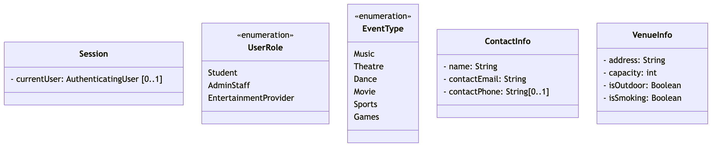
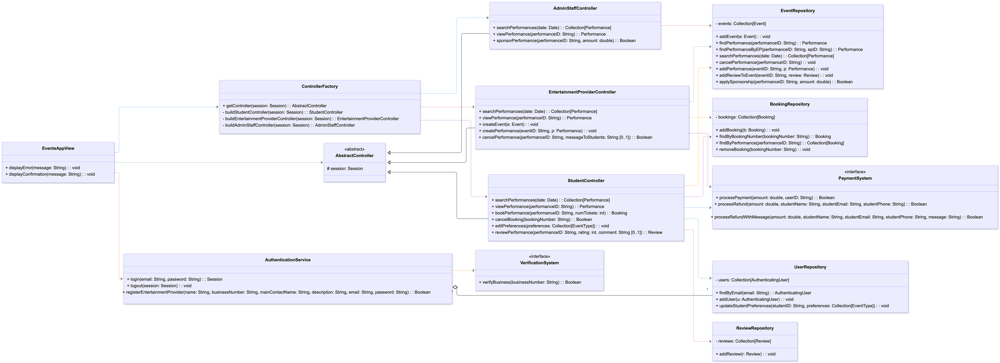
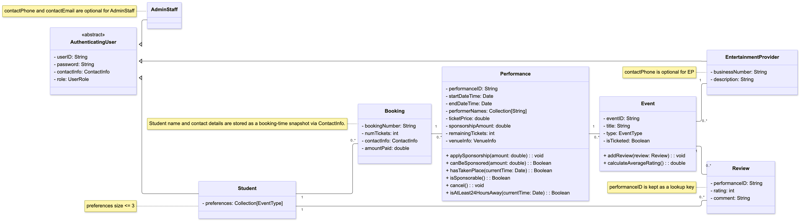
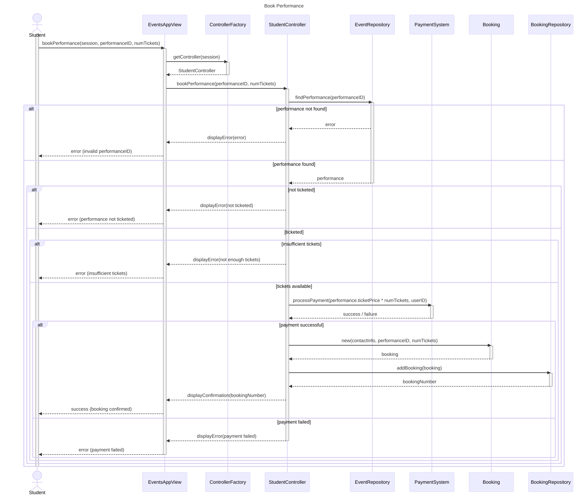
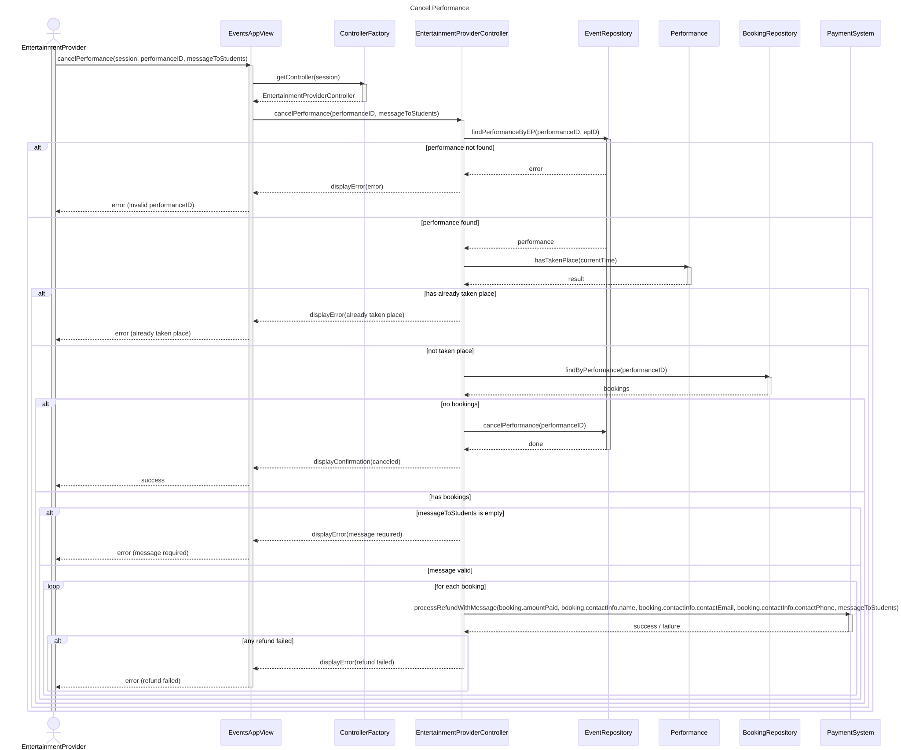
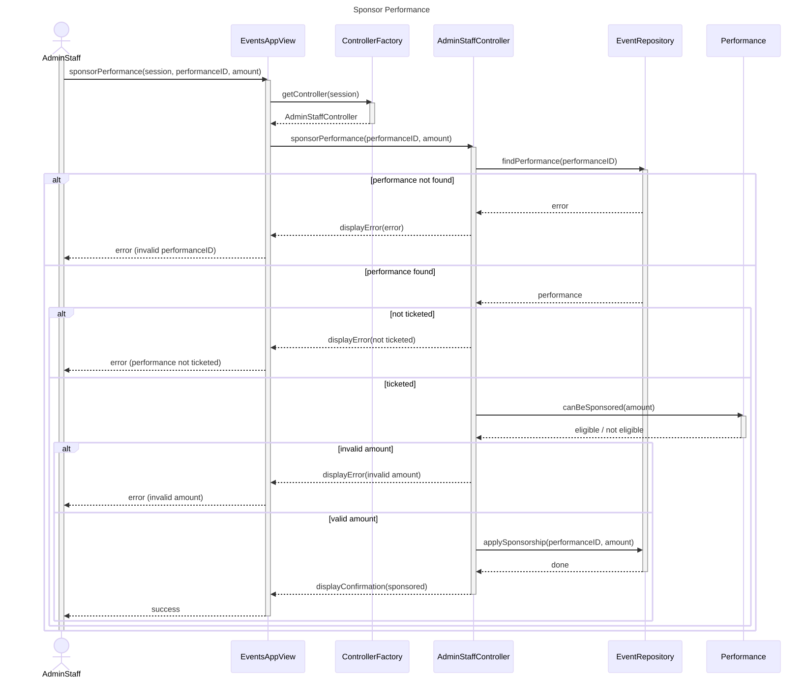
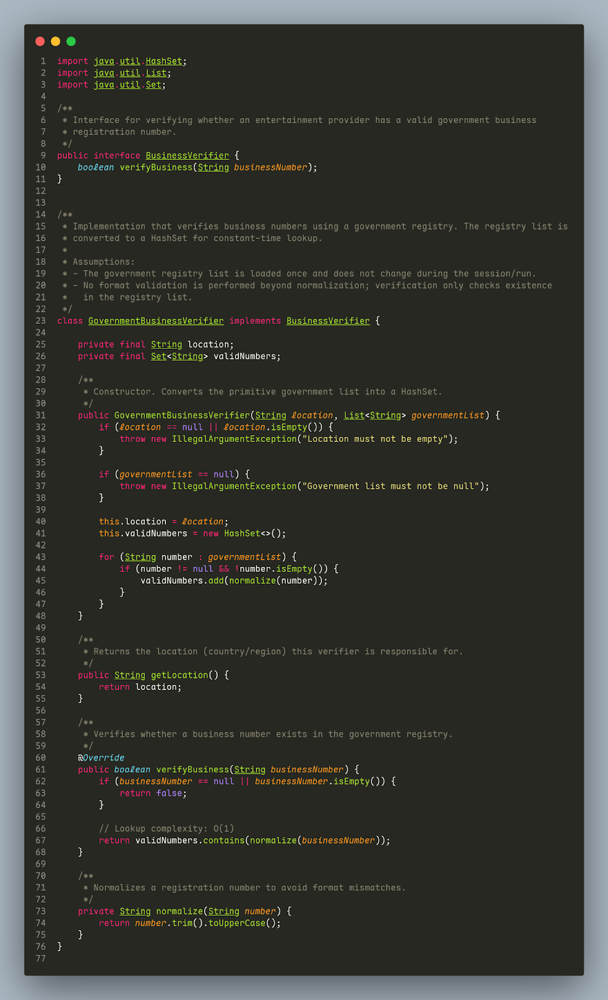

#

## Task1: Ambiguities and addressing them

1. Partial refund failure
   - If 3 out of 5 refunds succeed and 2 fail, we assume if any fail, cancel the whole operation (no performance cancellation).

2. How do we treat the case when admin staff sponsor a performance after user purchases performance tickets when the ticket is paid.
   - If adminstaff sponsor a performance after user paid the ticket, we assume we refund the sponsor amount to user and update amountpaid variable in Booking.

3. R19 event removal mentions “Cancelling all performance for an event shall remove the event itself.” Is this automatic or does someone trigger it?
   - We assumed: handled internally by `EventRepository.cancelPerformance()`

4. Does anything happen when a student books more tickets than expected to counter accidents?
   - No, they should notice the number of tickets from the receipt and manually cancel the booking if it was done unintentionally.

5. Does the system remove booking records after the performance ends or the booking is cancelled?
   - Records are removed immediately when cancelling bookings, and 3 months after the performance ends.

6. What happens if a student inputs the same preference multiple times?
   - The system returns an error message.

7. What if a student attempts to review the same event multiple times?
   - The new review will overwrite the existing review.

8. What requirements must passwords meet when used to register EPs?
   - 6+ characters, at least 1 number and special character.

## Task2: UML class model

## Task3: High-level description of the UML class model

### Clarify unclear parts in the diagram

- System Layers and Structure
  - View layer: `EventsAppView`, responsible only for user interaction and displaying results
  - Controller layer: `StudentController`, `EntertainmentProviderController`, `AdminStaffController`, orchestrating use-case flows
  - Repository layer: `UserRepository`, `EventRepository`, `BookingRepository`, `ReviewRepository`, centralized data access and updates
  - Domain layer: `Event`, `Performance`, `Booking`, `Review`, `AuthenticatingUser` and its subclasses, holding business state and rules
  - External dependencies: `PaymentSystem`, `VerificationSystem` as interfaces

- Clarify unclear parts in the diagram
  - `ControllerFactory.getController(session)`: After login, the view requests the appropriate subcontroller using the `Session`. The factory returns `StudentController`, `EntertainmentProviderController`, or `AdminStaffController` based on `session.currentUser.role`. If `session.currentUser` is null or the role is invalid, it should deny creation or throw to prevent unauthenticated access
  - `Session`: Tracks the current login state. Its core responsibility is holding `currentUser: AuthenticatingUser [0..1]`. `AuthenticationService.login()` writes the current user on success, and `logout()` clears it. Anything that needs to know “who is operating” reads from \`Session\`
  - `AuthenticationService`: Handles only authentication. It validates credentials through `UserRepository` and verifies EP registration via `VerificationSystem`. On success it returns a `Session` containing the logged-in user
  - Why `EventsAppView` depends on `AuthenticationService`, `ControllerFactory`, and `AbstractController`: The view logs in, obtains a subcontroller via the factory, and calls that subcontroller directly
  - `EventRepository.findPerformance(performanceID)`: A general lookup by ID with no ownership check
  - `EventRepository.findPerformanceByEP(performanceID, epID)`: Used only for EP operations. It verifies ownership; if the performance does not belong to the EP, it returns null or throws, and the operation is rejected

### Design principle

- **Cohesion:**
  - Each class has a single responsibility. `BookingRepository` manages bookings only, `EventRepository` manages events and performances only; `StudentController` groups only student-facing operations (for example `bookPerformance()`, `cancelBooking()`, `reviewPerformance()`), while `AdminStaffController` contains only admin operations such as `sponsorPerformance()`

- **Coupling**
  - The three subcontrollers inherit `AbstractController` and share session/authorization logic but do not depend on each other directly. The view does not route to controllers itself; it calls `ControllerFactory.getController(session)`, so internal role routing is hidden from the view

- **Abstraction**
  - `AuthenticatingUser` captures common user state (userID, password, contactInfo, role) and is extended by Student, EntertainmentProvider, and AdminStaff. AbstractController` captures session internally

- **Encapsulation / Information Hiding**
  - Domain state is mutated through methods rather than direct field access, for example `Performance.applySponsorship()` and `Performance.cancel()`. Repositories hide internal collections and expose only query/update methods. Business rules live primarily in domain objects rather than controllers

- **Separation of Interface and Implementation**
  - `PaymentSystem` and `VerificationSystem` are modeled as interfaces; controllers depend on these interfaces, enabling provider swaps without changing controller logic`

- **Decomposition / Modularisation**
  - The system is split into view, controller, repository, and domain layers with clear interfaces, allowing a developer to evolve one part (for example `EntertainmentProviderController`) without understanding the entire system

### Design patterns

- MVC:
  - The three-layer split is explicit. `EventsAppView` is the View, the controller hierarchy (`ControllerFactory` \+ the three role-specific controllers) is the Controller, and domain objects plus repositories form the Model. The View only depends on controllers and has no direct access to repositories or domain objects; the Model is independent of presentation. The controllers act as the middle layer that coordinates use-case flows. Example flow: for search, the View calls `StudentController.searchPerformances(date)`, the controller queries `EventRepository.searchPerformances(date)`, returns a `Performance` collection, and the View renders it. MVC is chosen for separation of concerns and low coupling; replacing the UI would not require changes to Model or Controller logic.
- Factory pattern
  - `ControllerFactory` constructs the role-specific controller based on `Session`, centralizing the routing decision. The factory hides construction details (for example, shared dependencies and session wiring), so the View never needs to instantiate controllers directly. Adding a new role only requires a new controller plus an update in the factory.

 

## Task4: UML sequence diagrams

- Book performance

Cancel performance

Sponsor performance

## Task5: Low-level design

1. What assumptions does your solution make, besides the one stated in the previous question?
   1. A single `GovernmentBusinessVerifier` instance is responsible for one location/region only. If multiple regions are needed, multiple instances would be created and managed externally.
   2. Business numbers are case-insensitive and may contain leading/trailing whitespace — the `normalize()` method handles this by trimming and converting to uppercase before both storing and looking up numbers, ensuring format mismatches do not cause false negatives.
   3. The government list is assumed to contain only business numbers relevant to the specified `location` — there is no cross-checking between the list content and the location string.
2. What kind of architecture distribution would be fitting here? Why? How does that ensure that your solution will scale?
   1. We think client-server architecture would be fitting here. The GovernmentBusinessVerifier would run server-side, loaded once at startup with the government registry. Clients are the registerEntertainmentProvider use case flow \- send verification requests to the server.
   2. This ensures scalability for several reasons. First, the registry is loaded into memory, so every subsequent request os O(1) regardless how many clients are making requests simultaneously. Second, we only need to update government list in one place.

## Task6: Reflection

- Reflection on teamwork
  - This time, we allocated two weeks for completion, dividing the work into two stages. In stage one, we aimed to complete Tasks 2, 3, and 4, with responsibilities split equally among team members. In stage two, we targeted Tasks 1, 5, and 6\. We used GitHub as our primary collaboration tool, which allowed us to track contributions and manage version control effectively. We also transitioned from draw.io to PlantUML for our diagrams, which made version-controlling our design documents much more straightforward, though we found draw.io more intuitive for composition and layout, so we would likely return to it in CW3.  
    Reflecting on the experience, stage one did not go as planned — some team members were unable to complete their assigned work by the agreed deadline, and communication within the group was limited. Rather than investigating why certain members were unresponsive, we moved forward without fully understanding the situation, which in hindsight was something we could have handled better. In stage two, the workload fell primarily on two members, which was challenging but ultimately allowed us to complete the coursework. From this experience, we learned that equal task distribution alone is not sufficient — regular check-ins and open communication are equally important. We should have reached out to struggling teammates earlier, understood their circumstances, and redistributed work proactively rather than reactively. Going forward, we would establish clearer communication expectations from the start, set intermediate checkpoints, and address any issues within the team promptly before they affect the final outcome.
- Reflection on the quality of your work
  - For Task 2, our initial class diagram placed all ten use cases and data directly inside a single `GeneralController`, which quickly proved problematic — the class was overloaded with responsibilities, violating the principles of high cohesion and low coupling covered in the lectures. Reflecting on this, we recognised that the controller needed to be decomposed. We introduced three actor-specific subcontrollers (`StudentController`, `EntertainmentProviderController`, `AdminStaffController`) and moved all data into separate repositories, keeping the controller layer purely coordinative. We also extracted `AuthorisationService` as a standalone component to centralise access control rather than scattering checks across methods.
  - One alternative we explored was a `ControllerFactory` pattern, which aimed to decouple `GeneralController` from the data layer by having the factory create subcontrollers that connect directly to the repositories. This approach went beyond what was directly covered in lectures and demonstrated an attempt to apply more advanced design thinking. We found this solution relatively clean and straightforward. Thus it becomes to our final plan. From this iterative experience, we learned that complexity is not inherently bad — what matters is whether it serves a clear purpose, and in this case it did.
